<h1 style="text-align:center">Curso de Treinador de Cães</h1>

<h2 style="text-align:center">Introdução</h2>

Especula-se que a origem dos cães tem registos arqueológicos desde há cerca de 135.000 anos atrás, em vários territórios mundiais, tais como [Europa](https://en.wikipedia.org/wiki/Europe), [Russia](https://en.wikipedia.org/wiki/Russia), [India](https://en.wikipedia.org/wiki/India), [America no Norte](https://en.wikipedia.org/wiki/North_America), [Mongólia](https://en.wikipedia.org/wiki/Mongolia) e [China](https://en.wikipedia.org/wiki/China). Com o nome cientifico de **Canis Lupus**, mais conhecido actualmente por [Lobo](https://en.wikipedia.org/wiki/Wolf), é a origem que deu "à luz" os [cães](https://en.wikipedia.org/wiki/Dog) que conhecemos actualmente e que diferenciam-se pelo aspecto estético, genético, como também comportamental, tendo o nome de **Canis Lupus Familiaris** e os restos arqueológicos destas subsespécie do Lobo, datam a 14.000 anos atrás, na [Alemanha](https://en.wikipedia.org/wiki/Germany).

 **Nota Pessoal**: _Sabe-se que a humanidade sempre tentou usar outros seres vivos para se alimentar, para a ajudar em várias funções de trabalho, para atribuir beleza a sua estética social, como também na necessidade de apropriação da matéria terrestre e extraterrestre, ou até de todos os organismos vivos. Naturalmente que este evento histórico e comportamental da humanidade, representa uma espécie de adaptação social entre as várias espécies. Este processo de habituação, demorou vários séculos e continua a dar-se nas sociedades, ora na pespectiva de cuidar e salvar espécies em instinção, seja na necessidade de conviver com as várias espécies não humanas, mas que podem ser humanizadas, pois naturalmente todo o processo repetitivo é por si só, um processo educativo._ 
 
 A este acontecimento histórico deu-se o nome de "Vínculo humano-cão", para a relação de convivência entre cães e humanos, criando assim um vínculo afetivo que terá sido marcado na memória genética das diferentes espécies. 

Neste processo educativo, onde as várias espécies de cães tiveram contacto com as pessoas, qualidades e características destes animais, foram-se moldando e alterando, resultando na facilidade de coexistirem juntos. A este processo de restruturação das qualidades individuais dos cães, deu-se o nome de **Neotenia**. 

As grandes diferenças entre o Lobo e o Cão, é do lobo não ladrar e ser sexualmente monogâmico, enquanto que o cão ladra e é poligâmico, como também em pequenas diferenças entre o periodo de maturação individual. Actualmente o cão tem uma educação alimentar de comida contrafeita, o que também diminui os instintos predadores, pois o cão deixa de ter de caçar para comer, como também, deixa de ter contacto salivar com a carne crua. Talvez por esta razão, por vezes poderá haver cães que rejeitam comida que desconhecem, sendo que o nome desse evento de rejeição tem como definição de **Neofobia**. 

Considera-se que as diferentes raças caninas desenvolveram qualidades especificas, umas que são mais predatórias e outras mais dóceis e sociais, sabendo que, são as experiências de cada animal, que potenciam ou diminuem as irregularidades comportamentais. As técnicas educativas é que serão as responsáveis pelo comportamento futuro dos animais em questão. 

<h2 style="text-align:center">Classificação de Raças</h2>

As diferentes raças de cães foram categorizadas em 10 diferentes grupos, para filtrar e dividir as difetentes raças em distinções estéticas e temperamentais, nas [344](https://en.wikipedia.org/wiki/List_of_dog_breeds) diferentes raças caninas.

- **Primeiro Grupo**: [Cães de Pastor e Boieiros](https://www.fci.be/en/nomenclature/1-Sheepdogs-and-Cattledogs-except-Swiss-Cattledogs.html)
Todas as raças deste grupo têm como característica a enorme vontade de trabalharem em conjunto. Os cães de pastor são animais inteligentes animais de trabalho e são apreciados pela sua capacidade de estar em alerta. Raramente ladram e rapidamente se submetem à vontade dos humanos. Por outro lado, o instrumento de trabalho mais importante dos cães de pastoreio são precisamente os seus latidos, pois só assim conseguem reunir os rebanhos de ovelhas. Os Bearded Collie são cães alegres, de temperamento equilibrado e educados. Típica desta raça é a expressão empreendedora. O Cão de Pastor Branco Suiço evoluiu no  Canadá para uma raça independente – estes exemplares são ótimas companhias para crianças, além de atentos, e, ainda que nada agressivos, são excelentes cães de guarda.

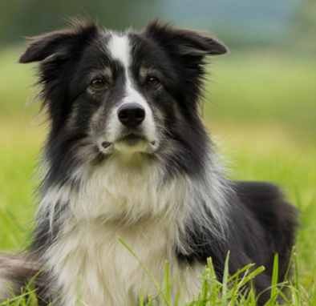

- **Segundo Grupo**: [Cães de tipo Pinscher e Schnauzer, Molossóides e Cães de Montanha, e Boieiros Suiços](https://www.fci.be/en/nomenclature/2-Pinscher-and-Schnauzer-Molossoid-and-Swiss-Mountain-and-Cattledogs.html)
Neste grupo incluem-se, além do Pinscher e do Schnauzer, o Smoushond, o Terrier Preto Russo, as raças tipo Dogue, tipo Montanha e ainda os Boieiros Suiços. Na secção dos Pinscher estão contempladas as raças  Dobermann e o Pinscher Miniatura. Estes animais terão sido introduzidos, no início do século XIX, a partir de Inglaterra para a terra firme do continente europeu. A Affenpinscher é uma das mais antigas raças alemãs e as suas características têm permanecido praticamente inalteradas. Os exemplares desta raça podem viver até aos 15 anos e adoram pessoas. Além disso, derretem-se com mimos, são bons cães de guarda e não têm necessidade de grande atividade física.

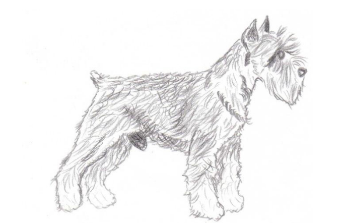

- **Terceiro Grupo**: [Terriers](https://www.fci.be/en/nomenclature/3-Terriers.html)
Neste grande grupo encontramos Terriers de tamanho grande e médio, Terriers de tamanho pequeno, Terriers de tipo Bull e Terriers de Companhia. Devido à sua aparência considerável, o Airedale Terrier é considerado o rei dos Terriers e é oriundo do condado de Yorkshire. Nesta zona, trabalhadores como mineiros ou agricultores precisavam de manter perto de si cães robustos para a caça e para conduzirem o gado, sendo os Airedale Terriers os animais indicados e que rapidamente encontraram muitos adeptos, em grande parte devido à sua fiabilidade e versatilidade. O Australian Terrier é uma raça que se adapta ao tamanho do apartamento citadino comum, desde que lhe sejam dadas oportunidades de fazer exercício suficiente. Originalmente esta era uma raça dedicada à guarda, pois os animais são robustos e fortes. O Fox Terrier de pelo cerdoso é também bastante comum na Europa, tendo sido bastante usado na caça da raposa e podendo ser visto em numerosos retratos históricos britânicos.

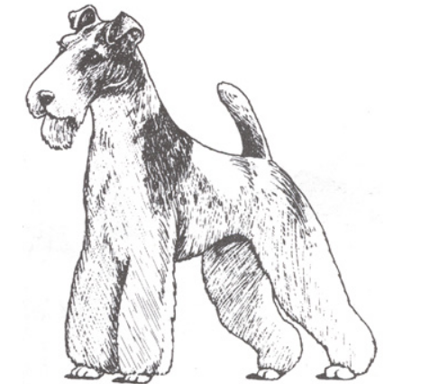

- **Quarto Grupo**: [Dachshund](https://www.fci.be/en/nomenclature/4-Dachshunds.html)
A raça Dachshund, também designada por Teckel ou 'salsicha', é conhecida desde a Idade Média. A partir da raça Bracken foram continuamente criados cães de pequena estatura, indicados para caçar ao nível do solo ou abaixo deste. Em resumo, assim se explicam as origens desta raça. Esta apresenta uma pelagem curta, densa e junto ao corpo com inúmeras gradações de cor entre o preto e o castanho-avermelhado. Os Dachshund são animais equilibrados, persistentes, com um faro delicado e bastante ágeis. Trata-se de uma raça criada em três tamanhos distintos – Standard, Miniatura e Kaninchen – e apresentam três comprimentos de pelo diferentes – cerdoso, comprido e raso. Os musculados Dachshund de pelo cerdoso não apresentam grande necessidade de movimento, podem chegar aos 17 anos e constituem excelentes cães de guarda.

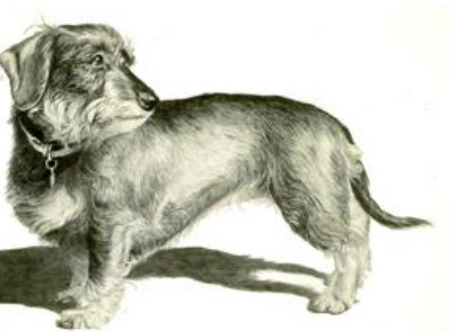

- **Quinto Grupo**: [Cães de tipo Spitz e de tipo Primitivo](https://www.fci.be/en/nomenclature/5-Spitz-and-primitive-types.html)
Neste grupo incluem-se os cães nórdicos de trenó, os cães nórdicos de caça, os cães nórdicos de guarda e pastoreio, e os Spitz europeus e asiáticos. O Spitz alemão é descendente do cão doméstico pré-histórico e, portanto, constitui a mais antiga raça da Europa Central. Os Spitz fazem-se notar pelo seu bonito pelo que sobressai bastante pela camada inferior. Os olhos vivaços e as orelhas pontiagudas conferem-lhe a aparência atrevida e animada que o caracteriza. O Spitz alemão é vivaz mas muito carinhoso e dócil e fácil de educar. Tratando-se de uma raça cautelosa no que diz respeito a desconhecidos é ideal como cão de guarda. As raças nórdicas são populares cães de pastoreio com pelo quentinho.

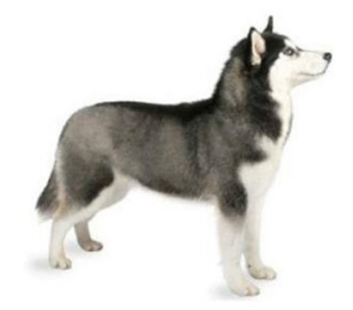

- **Sexto Grupo**: [Cães de Levante e Corso e raças semelhantes](https://www.fci.be/en/nomenclature/6-Scent-hounds-and-related-breeds.html)
Os cães de levante têm um faro bastante apurado e desde há muito que têm vindo a ajudar os humanos a caçar. Estes aceitam de bom grado as condições meteorológicas e seguem os rastos enuquanto ladram. Representantes deste grupo são, por exemplo, os Foxhound, os Laufhund, os Otterhund, os Français Tricolore e os Beagle. Os cães de corso são cães de caça especializados em encontrar presas feridas e, tal como os cães de levante, o seu olfato é apurado e segue explicitamente o rasto de animais selvagens feridos. Representantes deste tipo são o Sabujo montanhês da Baviera e o Basset alpino. Os cães de levante são treinados para caçar em matilha, ao passo que os cães de corso realizam as tarefas sozinhos.

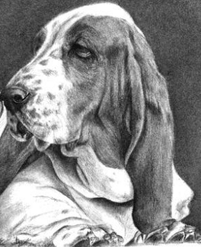

- **Sétimo Grupo**: [Cães de parar](https://www.fci.be/en/nomenclature/7-Pointing-Dogs.html)
Identificamos neste grupo cães de parar continentais como o Braco, o Spaniel e o Griffon, e ainda cães de parar britânicos e irlandeses, como os Pointer e os Setter. Os cães de parar devolvem prontamente peças de caça selvagem. São animais muito versáteis e a sua criação tem vindo a aumentar desde que as armas de fogo se tornaram populares. Não matam a presa, ao invés, apontam calmamente a sua posição. No que se refere a esta tarefa, a sua popularidade já viu melhores dias, mas pelo facto de combinarem características de diversas raças de caça são bastante requisitados como fiéis companheiros. No entanto, não devem ser mantidos como animais de estimação por leigos – o seu lugar é nas mãos dos caçadores.

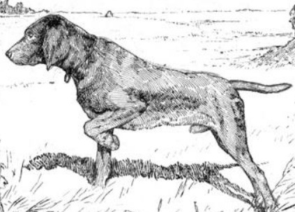

- **Oitavo Grupo**: [Cães Levantadores e Cobradores de Caça e Cães de Água](https://www.fci.be/en/nomenclature/8-Retrievers-Flushing-Dogs-Water-Dogs.html)
Os levantadores são cães de caça dedicados a encontrar animais selvagens voadores e a devolvê-los aos caçadores. Os cobradores são cães que procuram no mato, e de forma independente, por pequenos animais selvagens. Nesta categoria incluem-se as raças Cocker Spaniel inglês, Cocker Spaniel americano, Springer Spaniel inglês, Field Spaniel, pequeno cão holandês (ou  Kooikerhondje) ou o Springer Spaniel de Gales. Os cães de água contribuem com a sua ajuda em momentos de pesca. O American Spaniel descende do Springer Spaniel inglês e é a raça Spaniel de menores dimensões. O Chesapeake Bay Retriever foi criado especificamente para caçar na água e, além de cobrador, conseguir partir gelo e suportar águas geladas.

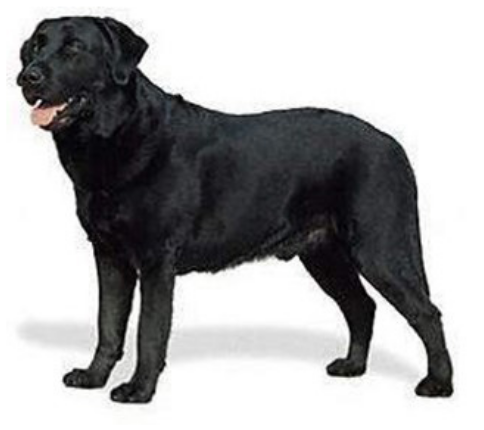

- **Nono Grupo**: [Cães de Companhia e de Assistência](https://www.fci.be/en/nomenclature/9-Companion-and-Toy-Dogs.html)
Falamos agora de cães que são usados pelos donos como animais de companhia e parceiros sociais. Neste grande grupo encontramos os Bichons, os Caniche, os cães belgas de tamanho pequeno, os cães nus, os cães do Tibete, os Pequinês e os Chihuahua.  O Bichon Frisé, por exemplo, é divertido, independente e bem-humorado, além de aprender rapidamente e ser fácil de educar. O Bichon Bolonhês, por seu lado, apresenta uma estatura física delicada, é sociável e adequado para famílias. O Bolonka é um verdadeiro cão de colo – os exemplares desta raça são amigáveis e vivaços e, portanto, fantásticos companheiros de brincadeiras. O Boston Terrier, raça criada em Boston na década de 70 do século XX, apresenta um temperamento bastante equilibrado – são animais espertos, ativos, determinados e dóceis. Desde a sua descoberta em 1850 que o Chihuahua é considerada a raça de cães mais pequena do mundo; acredita-se que descendem dos cães sacrificados em rituais há milhares de anos no antigo México. Desde o século XIX que os fazendeiros na província de Chihuahua vendem estes animais aos turistas, contribuindo assim para a raça se disseminasse na Europa. Os Chihuahuas podem apresentar traços de personalidade a oscilar entre o vigilante e o brincalhão.

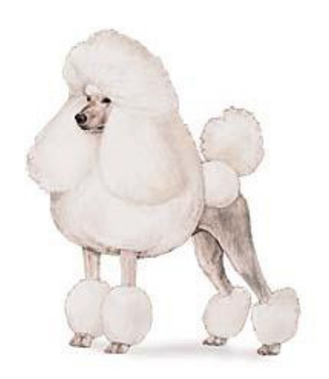

- **Décimo Grupo**: [Galgos](https://www.fci.be/en/nomenclature/10-Sighthounds.html)
Sejam galgos de pelo comprido e franjeado, de pelo cerdoso ou de pelo curto, estes cães elegantes e de longas pernas são dos animais terrestres mais rápidos do mundo, lado a lado com as chitas. Foram criados para o desempenho de tarefas concretas, como a caça de longa distância. De acordo com a origem de cada qual é possível diferenciar entre os galgos ocidentais e orientais – características destes últimos são as orelhas caídas e a independência de carácter, enquanto os galgos ocidentais são excelentes velocistas e têm orelhas cor-de-rosa.

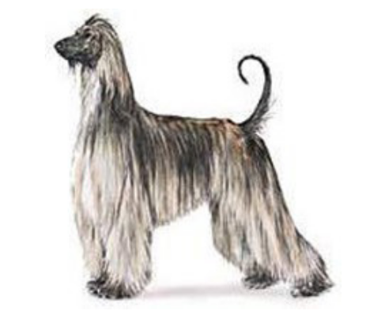

<h2 style="text-align:center">A Educação</h2>

**Nota Pessoal**: Todos as técnicas educativas, poderão usar métodos e formas de prémio ou de punição para atingir objectivos. É importante que a punição seja somente a negação de um prémio ou a negação de uma brincadeira e evitar ao máximo que a punição seja agressiva ou violenta. Existe um lado na psicologia animal que é usada nos cães e que também é usada em pessoas. Estas técnicas servem para avaliar comportamentos e treinar os seres a terem os comportamentos que desejamos ver neles. A psicologia é básica, mas serve perfeitamente para explicar ora comportamentos de cães ora até de pessoas. Por razões de adaptação histórica, muitas pessoas nos últimos séculos foram violentadas para aprender, sabendo que os animais também. Só recentemente é que nasceu uma luta contra o uso de violência para educar e como tal, temos na actualidade uma legislação que quer garantir que os seres humanos têm educações não violentas e que os cães e outros animais, também não tenham de passar por experiências violentas com o âmbito de educar comportamentos. 

<h3 style="text-align:center">Introdução à Psicologia Comportamental</h3>

Na perspectiva psíquica e analitica do cão, existe um teste que é feito nos primeiros meses de vida e que serve para medir o possível carácter futuro do cão. A este teste dá-se o nome de **Teste de Cambell**, que tem como principal objectivo saber qual é o comportamento do cão, ao nível da atratividade social, entre o cão e o dono. Este método é usado por criadores para saber se o cão se irá adaptar ao novo dono, e se existe alguma irregularidade comportamental do cão de negação, tal como virar as costas, rosnar ou tentar morder. Os resultados tẽm como objectivo principal saber se o cão é Dominante Agressivo, Dominante não-agressivo, Equilibrado, Submisso ou independente. 

Também existe um método de análise, que tem como intuíto saber quais as aptidões do cão para funções especificas, tal como saber se está preparado para actividades desportivas, ou se o cão está mais preparado para funções de trabalho. A esta técnica de análise dá-se o nome de **Liakhoff** e tem como principal objectivo medir a agressividade, a submissão, a vontade de agradar, a capacidade de adaptação, a concentração e a capacidade de abstração, como também saber se o cão sofre de algum medo. 

Ainda na fase Juvenil, pode-se tentar identificar problemas comportamentais, que poderão ser importantes observar, para evitar problemas futuros. Salvo haver certas raças que se demonstram agressivas desde tenra idade, a maioria dos cães saudáveis não se apresentam com essas características, tal como a agressividade com pessoas novas, o medo de outros cães ou de pessoas, a ansiedade de separação e a hiperatividade, que pode ser o resultado do ambiente em que vivem ou até o resultado das experiencias dos primeiros meses de vida. 

**Ivan Pavlov** é o pioneiro do condicionamento clássico, que tem como principal objectivo criar mudanças comportamentais num cão, a partir da associação de estímulos. Estes estímulos podem ser naturais ou artificiais. A observação de comportamentos que tinham origem inata, tal como salivar ao apresentar comida, levou ao investigador a tentar manipular o comportamento do cão, introduzindo uma nova variavel artificial, tal como um som externo, tal como o de uma campainha. Aos estímulos naturais tal como a comida existe a resposta de salivar e ao estímulo artificial depois de ser associado à comida, existe também a salivação sem apresentar a comida. 

Assim, este fisiologista descobre que é possível manipular e educar os cães a terem comportamentos que não teriam de forma natural, usando estímulos externos que podem ser positivos ou negativos e que irão ser úteis na definição comportamental destes cães. 

A estes estímulos, dá-se o nome de `Reforço Positivo` e `Reforço Negativo` e servem para aumentar e melhorar um comportamento desejável, ou serve para diminuir e "apagar" um comportamento indesejável, respectivamente.

É com base nestas técnicas educativas, que o treinador deve definir os comportamentos desejados e tentar impedir que os comportamentos indesejados aconteçam. Também por esta razão e por causa das variações educativas que os cães foram tendo ao longo do tempo, definiu-se limites e proibições no uso de mecanismos ou ferramentas na educação dos canídeos. 

<h3 style="text-align:center">As características inatas</h3>

Como se poderá ler nos diferentes grupos de cães que foram esquematizados, cada grupo apresenta diferentes características inatas que estão mais desenvolvidas, na comparação de outros grupos. Mesmo que todos os cães tenham características fisiológicas semelhantes ou até iguais, ao nível comportamental e temperamental, as qualidades emocionais de cada cão, permitem que cada grupo de cães, possa ter diferentes funções com base nas suas características físicas e temperamentais. 

<h2 style="text-align:center">Legislação</h2>

**Lei dos cães potencialmente perigosos**: [DL Nº 315/2009 de 29 de Outubro](https://diariodarepublica.pt/dr/detalhe/decreto-lei/315-2009-483402): 

"Esta lei define como potencialmente perigoso qualquer animal que, devido às características da espécie, comportamento agressivo, tamanho ou potência de mandíbula, possa causar lesão ou morte a pessoas ou outros animais, nomeadamente os cães pertencentes às seguintes raças, ou resultantes de cruzamentos com elas."

- Tenha mordido, atacado ou ofendido o corpo ou a saúde de uma pessoa;

**Nota Pessoal**: Portanto existe a definição de que qualquer cão pode ser **perigoso** a partir do momento que o canídeo tem uma atitude agressiva ou violenta contra outro cão ou pessoa, podendo causar a morte ou lesões físicas, não negando que existem os cães ``potencialmente perigoso``, por causa das suas características inátas e que poderão com maior facilidade, demonstrar esses comportamentos e causar esses resultados. A **Lei portuguesa** define como perigoso **qualquer animal** que tenha mordido, atacado ou ofendido o corpo ou a saúde de uma pessoa; tenha ferido gravemente ou morto outro animal fora da propriedade do detentor; tenha sido declarado como tal pelo seu detentor à junta de freguesia da sua área de residência; ou tenha sido considerado como tal pela entidade competente devido ao seu comportamento agressivo ou especificidade fisiológica. Como tal, a importância educativa de treinamento de cães que socializam publicamente com outros seres vivos ou pessoas, deverá passar por um processo de treino, para demonstrar que é capaz de se comportar devidamente em diferentes ambientes. Mesmo assim a lei também define a obrigatoriedade do uso de **trelas** para assegurar qualquer imprevisto, como também o uso do açaime, que para os cães perigosos ou potencialmente perigosos, tenham limites de ação. 

Em referência ao último [artigo do blog](https://criticasempiedade.blogspot.com/2024/08/bica-no-bica-5-falta-de.html) como crítica aos serviços da Nubika: 
Como tal, pode-se dizer que um cão que já **mordeu**, é **potencialmente perigoso**, pois pode voltar a morder. Sendo que ao ser **potencialmente perigo**, implicitamente é um cão **perigoso**. Este é um dos problemas que a Nubika, deverá ter o cuidado de tentar evitar, pois são questões lógicas que levam ao erro interpretativo, sendo que a diferença entre ambas as definições, está relacionada com o comportamento do animal e não às características que os cães considerados **potencialmente perigosos** apresentam como ``potenciais`` ou ``possíveis`` comportamentos pré-definidos. 

<h2 style="text-align:center">Etapas de Desenvolvimento</h2>

A **Etapa Pré-natal**, refere-se ao periodo antes do nascimento, a neonatal aos <ins>primeiros 14 dias</ins>, nos quais o cão ainda não é capaz de ver o mundo à sua volta, a **Etapa de Transição** que acontece <ins>entre os primeiros 13 a 21 dias</ins>, sendo que já são capazes de ver o mundo à sua volta e surgem os primeiros dentes de leite e a capacidade de distinguir diferentes sons, em seguida a **Etapa de Socialização**, sendo que é vital que haja a socialização com outros cães, e com pessoas em diferentes ambientes. A **Etapa Juvenil** acontece <ins>entre as 12 semanas e os 6 meses ou mais</ins>, tornando-se mais independente e tal como todos os adolescentes humanos, podem apresentar-se com demonstrações de falta de obediência, mais dispersão de atenção, maior distanciamento como também poderá demonstrar-se com falta de atenção. Finalmente inicia-se a **Etapa Adulta**, <ins>entre os primeiros 7 anos</ins> e em seguida a **Etapa Sénior** a partir dos 7 anos de vida, periodo este que tal como nas pessoas, aparecem as dificuldades motoras e irregularidades de saúde física e mental. 

<h2 style="text-align:center">Introdução à Comunicação Canina</h2>

Todos os mamiferos, quando nascem têm várias formas de falar, usando sons ou expressões corporais que podem indicar, vontades ou formas de estar. Dependendo do contexto diferentes sons podem ser produzidos, que definem também os estados emocionais. [Turid Rugaas](https://en.wikipedia.org/wiki/Turid_Rugaas) escreve o livro [Calming Signals](https://www.dogwise.com/on-talking-terms-with-dogs-calming-signals-2nd-edition/) para descrever os diferentes sons emitidos pelos cães para evitar conflitos entre cães, o que permitiu conhecer os diferentes sinais emocionais que eram vocalizados, como também diferentes expressões corporais tal como com a cauda e as orelhas. 

<h3 style="text-align:center">Introdução à Linguagem Corporal</h3>

Considera-se que os cães demonstram comportamentos que têm como objectivo comunicar o seu estado emocional e respectivamente, fazer um pré-aviso de qualquer irregularidade ou situação que está a lidar. Estes sinais podem referir um estado de calma, stress, desconfiança, etc. 

<h3 style="text-align:center">Introdução à Linguagem Sonora Canina</h3>

Dependendo do contexto, existem diferentes momentos em que o cão Ladra. Os restantes sons também poderão acontecer em diferentes momentos, dependendo do contexto, sendo que gemer, rosnar, uivar e ganir, são facilmente associados a queixar-se de uma dor constante, ameaça ou perigo, solidão e queixar-se de um golpe ou de uma queda, respectivamente. 

<h3 style="text-align:center"> Linguagem Técnica da Psicologia e dos Estímulos Básicos</h3>

> O condicionamento clássico: 

Refere-se à condição que permite ensinar o cão ou pessoa a relacionar dois estímulos que não tinham qualquer relação antes da aprendizagem.

Existe um processo de transformação de valores, dependendo do contexto e condição dos estímulos usados. Quando o **Pavlov** praticava o teste de manipulação psíquica do animal, usou uma campainha e chamou a esta ferramenta, um **estímulo neutro**. Tocou a campaínha várias vezes e o cão não teve uma resposta fisiolófica além de possivelmente, prestar atenção ao novo som. Ao apresentar comida que é mais tarde considerado um elemento instrumental, com o nome de **condicionamento operante**, o cão saliva, sendo a salivação do cão, uma **resposta incondicionada** e a esta nova ferramenta apresentada, dá-se o nome de **estímulo incondicionado**, porque tem base numa resposta que não foi aprendida. Num processo repetitivo deste teste, o cão acaba por salivar sempre o que som da campainha toca que é considerado após a repetição do exercício, um **estímulo condicionado**, sendo esta resposta comportamental, uma **resposta condicionada** e assim, considera-se que o cão aprendeu a associar um som à comida. 

> Via um processo semelhante, as pessoas trabalham para ganhar dinheiro e o dinheiro oferece-lhes a liberdade de escolha, para comer ou passear, sendo esta técnica intencionalmente focada para a participação de qualquer função.  

O instrumento de treino que aponta para uma recompensa, pode ser comida tal como "biscoitos de cão", ou uma carícia, ou palavras, tal como "muito bem", e que será repetida, sempre que o cão fizer o que queremos que ele faça. A esta técnica dá-se o nome de **Lei do Reforço**. Esta lei, tem dois polos incluídos. O polo positivo onde existe a recompensa alimentar, tendo o nome de **reforço positivo** e o polo negativo, onde se usam técnicas que são desagradáveis aos cães, tendo o nome de **reforço aversivo**. 

Existe ainda a definição de punição que também é dual. Considera-se que a **punição negativa** tem como objectivo a diminuição de um comportamento repetitivo, como também considera-se que a **punição positiva** que tem o mesmo objectivo e que é apresentado como um estímulo aversivo sempre que existe uma resposta comportamental do cão. 

<h3 style="text-align:center">A Linguagem Corporal Canina</h3> 

1. **Virar a cabeça** para um lado ou até vira-se de costas, é um sinal de querer evitar o contacto visual, pois para os cães, o contacto visual de um estranho é visto como uma ameaça. Por essa razão é sempre bom evitar o contacto visual com cães desconhecido. 
O mesmo acontece pessoas, principalmente se não existe uma comunicação além do contacto visual. É um aspecto comum entre todos os seres vivos e que poderemos pensar que está relacionado com a "intimidade". 

2. **Lamber o focinho** é um sinal que antecipa um comportamento agressivo. 
3. **Ficar estático** e com um olhar fixo é um comportamento que dependendo da reação do outro cão, pode ter várias reações. Ora atacar ora fugir.
4. **Ter movimentos lentos** para acalmar o outro cão. 
5. **Ficar em posição de brincadeira**. 

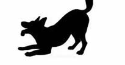

6. **Bocejar** para aliviar o stress. 
7. **Farejar** é uma forma de ignorar outro cão e demonstrar desinteresse, ajudando-o a gerir melhor situações para evitar conflitos. 
8. **Intervir** é um comportamento que acontece para tentar impedir um conflito. 
9. **Coçar-se**. 
10. **Deitar-se de barriga para cima**, é um sinal de submissão para evitar um conflito e que é muito comum em cães da etapa juvenil. 

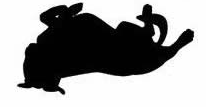

11. **Sacudir-se** serve para aliviar o stress. 
12. **Abanar a cauda**: Os movimentos da cauda dão muitas dicas sobre os sentimentos do seu cão! Todas as posições da cauda que vão ser referidas a seguir devem ser sempre avaliadas em conjunto com as expressões faciais e posições corporais que o cão dá. Como por exemplo, a posição das orelhas, do corpo, o facto de rosnar, ou ladrar, entre outros. Desta forma consegue-se decifrar o que o cão está a querer transmitir.

i. **Cauda escondida entre as pernas**:
Esta posição da cauda pode revelar ansiedade, medo, stress ou desconforto e aparece quando o cão está num ambiente desconhecido ou quando conhece novas pessoas ou animais. Os cães menos confiantes têm uma maior tendência a ter a cauda nesta posição quando, por exemplo, vão à clínica veterinária, ou quando ouvem sons altos ou sentem movimentos repentinos.

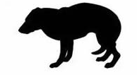

ii. **Cauda numa posição ligeiramente baixa, relaxada**:
Significa que o cão está calmo, relaxado e confiante. Em raças de cães com a cauda enrolada, como o Pug e o Samoiedo, a sua posição natural é enrolada sobre o dorso, mas pode deixar de estar enrolada em situações em que o cão está deitado e completamente relaxado. Pelo contrário, em raças como o Galgo Inglês, a posição natural e relaxada da cauda pode localizar-se ligeiramente entre as pernas, não representando o que foi referido no ponto número 1.

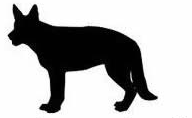

iii. **Cauda numa posição alta** :
Os cães com a cauda nesta posição geralmente estão confiantes, alerta para o que os rodeia e podem demonstrar um comportamento dominante. Movimentos rápidos da cauda nesta posição demonstram também excitação. Quando, além da cauda estar numa posição alta, está também com bastante tensão e com pêlo eriçado, significa que o cão está reactivo ao que o rodeia, podendo anteceder um comportamento agressivo.

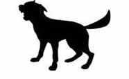

iv. **Cauda alinhada com o corpo, numa posição neutra**:
Uma posição neutra significa que o cão está a receber e a processar nova informação e pode também indicar uma postura defensiva.

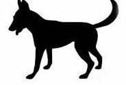
    
v. **Movimentos da cauda**:
O abanar de cauda nem sempre significa que o cão está contente! Alguns estudos indicam que quando a cauda está a movimentar-se maioritariamente para o lado direito é sinal de alegria, entusiasmo e acontece quando o cão se depara com alguém ou outro cão que já conhece e do qual gosta. Quando a cauda se movimenta maioritariamente para o lado esquerdo há uma maior associação a sentimentos negativos. A explicação para esta diferença relaciona-se com o facto do hemisfério esquerdo do cérebro ser o que está associado a sentimentos mais positivos e ser o que controla o lado direito do corpo e vice-versa.

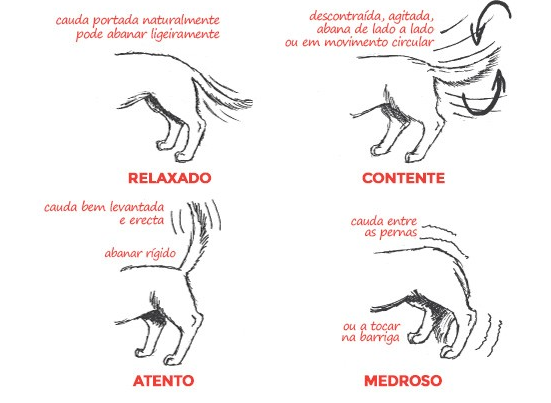

13. **As Orelhas**: As orelhas juntamente com a cauda são as duas partes do corpo que indicam mais acerca da comunicação canina. No entanto, são também os que mais variam de cão para cão… por isso, a sua interpretação pode ser tanto óbvia como um pesadelo!

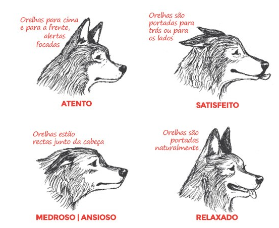

14. **Os Olhos**: Tal como uma pessoa, os olhos dos cães podem ser muito expressivos. Os seus olhos podem revelar pequenas mudanças do estado de espírito consoante a forma, as pupilas e as “sobrancelhas” do olho. No mundo humano (e cultura), o contacto visual é um sinal de atenção, respeito, amor… é algo positivo. No mundo canino, não é bem assim. Normalmente os cães olham uns para os outros, mas rapidamente desviam o olhar como forma de eliminar qualquer sinal de ameaça. Cães que já se conhecem bem não têm qualquer problema em estabelecer contacto visual. Contacto directo e durante muito tempo pode ser traduzido como uma ameaça ou um desafio. Quando vir um cão pela primeira vez evite olhar-lhe fixamente nos olhos.

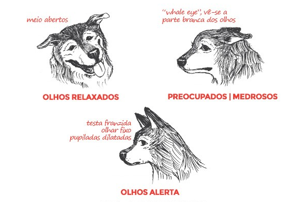

15. **A Boca**: Um dos elementos de comunicação mais complexos é a boca. A boca de um cão é como as nossas mãos; usamo-las para descobrir o mundo e normalmente brincamos ou movimentamo-las inquietamente quando estamos nervosos, desconfortáveis ou não sabemos o que fazer.

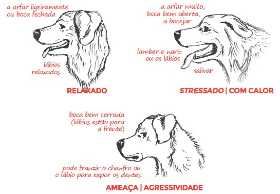

16. **O Pelo**: A erecção dos pêlo é sinal de um nível de alerta máximo e pode vir em várias formas, desde medo a contentamento ou excitação. Os pêlos levantados são normalmente associados à agressão, mas nem sempre este é o caso e muitas vezes isto é um acto involuntário e não uma forma de comunicação. Sabe quando fica frio e os seus pêlos levantam? Pois, a chamada “pele de galinha” não acontece só nessa situação. A ereção dos Pêlo pode ser dificil de detectar em cães com muito pêlo, por isso, nestes casos, preste mais atenção às partes já mencionadas.

17. **Sinais de Ataque**: 

    1. Demonstra incómodo olhando para o outro lado, virando-se, bocejando e movendo-se lentamente. 
    2. Arranha e cheira o solo. 
    3. Mostra sinais de Stress :  o pelo do seu lombo fica eriçado, ofega, as pupilas ficam dilatadas e os olhos muito abertos, também pode tremer e sacudir-se. Estes sinais indicam que o cão se prepara para fugir ou para atacar. 
    4. O Cão deixa de mostrar sinais, permanece imóvel e foca-se na sua ameaça, caso não tenha conseguido neutralizá-la. 
    5. O Cão rosna e mostra os dentes. 
    6. Por último, faz um ataque e marca ou morde num acto de defesa própria ou como defesa de algo ou alguém que considera que lhe pertence.

<h3 style="text-align:center">A Comunicação Sonora Canina</h3>

**Comunicação**: Os cães utilizam o ladrar como forma de comunicação. Podem ladrar para o avisar que querem algo, como comida ou atenção, ou para o alertar de um potencial perigo. O ladrar também pode ser uma forma de os cães expressarem excitação ou frustração.

**Proteção**: Os cães protegem naturalmente o seu território e os seus entes queridos. O ladrar pode ser a sua forma de avisar os intrusos ou as ameaças sentidas para se manterem afastados. Embora este instinto seja útil, o ladrar excessivo pode ser problemático.

**Ansiedade e medo**: Os cães podem ladrar por ansiedade ou medo, especialmente quando se encontram em situações desconhecidas ou stressantes. É a sua forma de sinalizar o seu desconforto ou de tentar defender-se.

**Tédio e solidão**: Os cães deixados sozinhos durante longos períodos podem recorrer ao ladrar como forma de aliviar o tédio ou a solidão. Podem estar a procurar atenção ou simplesmente a tentar passar o tempo.

**Problemas médicos**: Por vezes, o ladrar excessivo pode ser um sintoma de um problema médico subjacente, como dor ou desconforto. Se o ladrar do seu cão parecer invulgar ou fora do normal, é melhor consultar um veterinário.

**Excitação**: Este ladrar exprime alegria ou expectativa de que algo de bom irá acontecer. Esta vocalização destingue-se pelo seu som alto e agudo que pode acompanhar com sequências de gemidos. 

**Aviso**: Um som curto e forte, que avisa um possível inimígo. 

**Aprendido**: Na associação de um reforço positivo, o cão repete este ladrar, para atingir o objectivo. 

<h3 style="text-align:center">Avaliação de Comportamentos Indesejáveis</h3>

    1. Identificar possíveis comportamentos indesejaveis. 
    2. identificar possíveis fontes desses comportamentos indesejáveis. 
    3. A falta de conhecimento do dono.
    4. Saber o histórico do cão. 
    5. Ambiente e rotina diária.
    6. Relacionamentos. 
    7. Reações a pessoas e animais
    8. Treino. 
    9. Resposta à manipulação
    10. Experiências anteriores

<h3 style="text-align:center">Identificação de factores Bióticos</h3>

1. **Relações Interespécies**: referem o lado hormonal da espécie, como também toda a relação comportamental, entre idade ou experiências passadas, como também falta de sociabilização, que não o permite entender os sinais de outros animais. 

2. **Relações Interespecíficas**: Refere-se à relação do cão com outras espécies, sejam elas outros cães, pessoas, gatos, pássaros, etc. O processo de sociabilização entre cães ou outras espécies é essencial existir. 

<h3 style="text-align:center">Métodos para eliminar Comportamentos Indesejáveis</h3>

1. **Dessensibilização Sistemática Progressiva**: Consiste em expor um cão ao estímulo que desenvadeia o comportamento indesejável, sem que o comportamento indesejável ocorra. 
2. **Contra-Condicionamento**: É a capacidade de associar um comportamento indesejável a outro comportamento desejável.  
3. **Habituação**: Tal como o nome indica, é um processo repetitivo que espera que o "estranho" se "entranhe". 
4. **Imersão**: Consiste em expor um cão ao estímulo até que o comportamento desapareça. 
5. **Extinção**: Consiste em eliminar o que é agrável para o cão. 

**Nota Pessoal**: Parece tudo a mesma coisa. É sempre uma pespectiva de manipulação, onde a associação de memórias sejam substituídas por outras, para que as novas, ganhem importância sobre as anteriores. 

<h3 style="text-align:center">Tipos de Agressividade</h3>

1. **Agressividade Ofensiva**: Consiste em defender, guardar ou proteger.
2. **Agressividade Defensiva**: Consiste em defender-se quando está com medo. 

<h4 style="text-align:center">Causas de Agressividade</h4>

1. **Causa Orgânica**: Dor Intensa interna. 
2. **Conflito Social**: Família.
3. **Competitividade**: Outros cães. 
4. **Medo**: Ataques imprevisíveis
5. **Território**: Falemos das pessoas :D 
6. **Intrasexual**: Vários cães para uma cadela. 

<h4 style="text-align:center">Sequência de Agressividade</h4>

    1. Sinais de Ansiedade 
    2. Ladrar, pelo Eriçado
    3. Rosnar
    4. Expor Dentes
    5. Morder o Ar
    6. Morder 

<h4 style="text-align:center">Medidas a tomar para diminuir a Agressividade</h4>

    1. Mudar de ares.
    2. Conviver com outras pessoas
    3. Passear mais
    4. Correr mais
    5. Dominar os exercícios básicos
    6. Conviver com outros animais

<h4 style="text-align:center">Sintomas que provocam Comportamentos Indesejáveis</h4>

    1. Miccção e Defecação
    2. Ansiedade
    3. Ladrar Compulsivamente
    4. Destruir objectos
    5. Problemas de Socialização 

<h4 style="text-align:center">Comportamentos Agressivos em Patologias</h4>

    1. Dor
    2. Processos Infecciosos
    3. Alterações do Cio da Cadela
    4. Perturbações do Sistema Nervoso

<h4 style="text-align:center">Doenças Neurológicas</h4>

    1. Epilépsia
    2. Hérnias discais
    3. Tumores
    4. Síndrome de Shaker
    5. Disfunção cognitiva
    6. Patologias medulares

<h4 style="text-align:center">Doenças</h4>

**Doenças Virais**: 
    
    1. Cinomose Canina (Esgana)
    2. Hepatite Infeciosa Canina
    3. Parvovirose Canina
    4. Coronavírus Canino
    5. Traqueobronquite Infeciosa
    6. Raiva
    7. Papilomatose

**Doenças Bacterianas**: 

    1. Leptospirose
    2. Brucelose
    3. Tétano
    4. Estomatite Gangrenosa

**Infeções Parasitárias**: 

    1. Ascaridíase
    2. Dipylidium Caninum
    3. Equinococose
    4. Dirofilariose
    5. Leishmaniose
    6. Piroplasmose
    7. Sarna

**Infeções Fúngicas**:

    1. Dermatofitose
    2. Malassezia

**Doenças não Infeciosas**:

    1. Síndrome de Cushing
    2. Diabetes
    3. Hipotiroidismo

**Doenças do Sistema Músculo-Esquelético**:

    1. Displasia da Anca
    2. Displasia do Cotovelo

