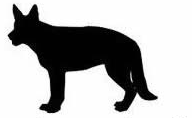
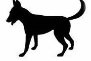
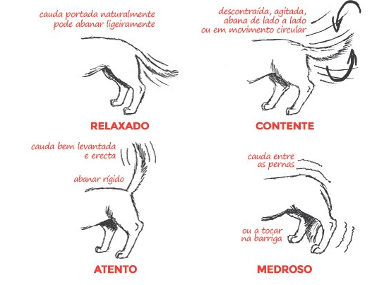

<h2 style="text-align:center">Introdução à Comunicação</h2>

Todos os mamiferos, quando nascem têm várias formas de falar, usando sons ou expressões corporais que podem indicar, vontades ou formas de estar. Dependendo do contexto diferentes sons podem ser produzidos, que definem também os estados emocionais. [Turid Rugaas](https://en.wikipedia.org/wiki/Turid_Rugaas) escreve o livro [Calming Signals](https://www.dogwise.com/on-talking-terms-with-dogs-calming-signals-2nd-edition/) para descrever os diferentes sons emitidos pelos cães para evitar conflitos entre cães, o que permitiu conhecer os diferentes sinais emocionais que eram vocalizados, como também diferentes expressões corporais tal como com a cauda e as orelhas. 

<h3 style="text-align:center">Introdução à Linguagem Corporal</h3>

Considera-se que os cães demonstram comportamentos que têm como objectivo comunicar o seu estado emocional e respectivamente, fazer um pré-aviso de qualquer irregularidade ou situação que está a lidar. Estes sinais podem referir um estado de calma, stress, desconfiança, etc. 

<h3 style="text-align:center">Introdução à Linguagem Sonora Canina</h3>

Dependendo do contexto, existem diferentes momentos em que o cão Ladra. Os restantes sons também poderão acontecer em diferentes momentos, dependendo do contexto, sendo que gemer, rosnar, uivar e ganir, são facilmente associados a queixar-se de uma dor constante, ameaça ou perigo, solidão e queixar-se de um golpe ou de uma queda, respectivamente. 

<h3 style="text-align:center">A Linguagem Corporal Canina</h3> 

1. **Virar a cabeça** para um lado ou até vira-se de costas, é um sinal de querer evitar o contacto visual, pois para os cães, o contacto visual de um estranho é visto como uma ameaça. Por essa razão é sempre bom evitar o contacto visual com cães desconhecido. 
O mesmo acontece pessoas, principalmente se não existe uma comunicação além do contacto visual. É um aspecto comum entre todos os seres vivos e que poderemos pensar que está relacionado com a "intimidade". 

2. **Lamber o focinho** é um sinal que antecipa um comportamento agressivo. 
3. **Ficar estático** e com um olhar fixo é um comportamento que dependendo da reação do outro cão, pode ter várias reações. Ora atacar ora fugir.
4. **Ter movimentos lentos** para acalmar o outro cão. 
5. **Ficar em posição de brincadeira**. 

6. **Bocejar** para aliviar o stress. 
7. **Farejar** é uma forma de ignorar outro cão e demonstrar desinteresse, ajudando-o a gerir melhor situações para evitar conflitos. 
8. **Intervir** é um comportamento que acontece para tentar impedir um conflito. 
9. **Coçar-se**. 
10. **Deitar-se de barriga para cima**, é um sinal de submissão para evitar um conflito e que é muito comum em cães da etapa juvenil. 

11. **Sacudir-se** serve para aliviar o stress. 
12. **Abanar a cauda**: Os movimentos da cauda dão muitas dicas sobre os sentimentos do seu cão! Todas as posições da cauda que vão ser referidas a seguir devem ser sempre avaliadas em conjunto com as expressões faciais e posições corporais que o cão dá. Como por exemplo, a posição das orelhas, do corpo, o facto de rosnar, ou ladrar, entre outros. Desta forma consegue-se decifrar o que o cão está a querer transmitir.

i. **Cauda escondida entre as pernas**:
Esta posição da cauda pode revelar ansiedade, medo, stress ou desconforto e aparece quando o cão está num ambiente desconhecido ou quando conhece novas pessoas ou animais. Os cães menos confiantes têm uma maior tendência a ter a cauda nesta posição quando, por exemplo, vão à clínica veterinária, ou quando ouvem sons altos ou sentem movimentos repentinos.

ii. **Cauda numa posição ligeiramente baixa, relaxada**:
Significa que o cão está calmo, relaxado e confiante. Em raças de cães com a cauda enrolada, como o Pug e o Samoiedo, a sua posição natural é enrolada sobre o dorso, mas pode deixar de estar enrolada em situações em que o cão está deitado e completamente relaxado. Pelo contrário, em raças como o Galgo Inglês, a posição natural e relaxada da cauda pode localizar-se ligeiramente entre as pernas, não representando o que foi referido no ponto número 1.

iii. **Cauda numa posição alta** :
Os cães com a cauda nesta posição geralmente estão confiantes, alerta para o que os rodeia e podem demonstrar um comportamento dominante. Movimentos rápidos da cauda nesta posição demonstram também excitação. Quando, além da cauda estar numa posição alta, está também com bastante tensão e com pêlo eriçado, significa que o cão está reactivo ao que o rodeia, podendo anteceder um comportamento agressivo.

iv. **Cauda alinhada com o corpo, numa posição neutra**:
Uma posição neutra significa que o cão está a receber e a processar nova informação e pode também indicar uma postura defensiva.

    
v. **Movimentos da cauda**:
O abanar de cauda nem sempre significa que o cão está contente! Alguns estudos indicam que quando a cauda está a movimentar-se maioritariamente para o lado direito é sinal de alegria, entusiasmo e acontece quando o cão se depara com alguém ou outro cão que já conhece e do qual gosta. Quando a cauda se movimenta maioritariamente para o lado esquerdo há uma maior associação a sentimentos negativos. A explicação para esta diferença relaciona-se com o facto do hemisfério esquerdo do cérebro ser o que está associado a sentimentos mais positivos e ser o que controla o lado direito do corpo e vice-versa.

13. **As Orelhas**: As orelhas juntamente com a cauda são as duas partes do corpo que indicam mais acerca da comunicação canina. No entanto, são também os que mais variam de cão para cão… por isso, a sua interpretação pode ser tanto óbvia como um pesadelo!

14. **Os Olhos**: Tal como uma pessoa, os olhos dos cães podem ser muito expressivos. Os seus olhos podem revelar pequenas mudanças do estado de espírito consoante a forma, as pupilas e as “sobrancelhas” do olho. No mundo humano (e cultura), o contacto visual é um sinal de atenção, respeito, amor… é algo positivo. No mundo canino, não é bem assim. Normalmente os cães olham uns para os outros, mas rapidamente desviam o olhar como forma de eliminar qualquer sinal de ameaça. Cães que já se conhecem bem não têm qualquer problema em estabelecer contacto visual. Contacto directo e durante muito tempo pode ser traduzido como uma ameaça ou um desafio. Quando vir um cão pela primeira vez evite olhar-lhe fixamente nos olhos.

15. **A Boca**: Um dos elementos de comunicação mais complexos é a boca. A boca de um cão é como as nossas mãos; usamo-las para descobrir o mundo e normalmente brincamos ou movimentamo-las inquietamente quando estamos nervosos, desconfortáveis ou não sabemos o que fazer.

16. **O Pelo**: A erecção dos pêlo é sinal de um nível de alerta máximo e pode vir em várias formas, desde medo a contentamento ou excitação. Os pêlos levantados são normalmente associados à agressão, mas nem sempre este é o caso e muitas vezes isto é um acto involuntário e não uma forma de comunicação. Sabe quando fica frio e os seus pêlos levantam? Pois, a chamada “pele de galinha” não acontece só nessa situação. A ereção dos Pêlo pode ser dificil de detectar em cães com muito pêlo, por isso, nestes casos, preste mais atenção às partes já mencionadas.

17. **Sinais de Ataque**: 

    1. Demonstra incómodo olhando para o outro lado, virando-se, bocejando e movendo-se lentamente. 
    2. Arranha e cheira o solo. 
    3. Mostra sinais de Stress :  o pelo do seu lombo fica eriçado, ofega, as pupilas ficam dilatadas e os olhos muito abertos, também pode tremer e sacudir-se. Estes sinais indicam que o cão se prepara para fugir ou para atacar. 
    4. O Cão deixa de mostrar sinais, permanece imóvel e foca-se na sua ameaça, caso não tenha conseguido neutralizá-la. 
    5. O Cão rosna e mostra os dentes. 
    6. Por último, faz um ataque e marca ou morde num acto de defesa própria ou como defesa de algo ou alguém que considera que lhe pertence.

<h3 style="text-align:center">A Comunicação Sonora Canina</h3>

**Comunicação**: Os cães utilizam o ladrar como forma de comunicação. Podem ladrar para o avisar que querem algo, como comida ou atenção, ou para o alertar de um potencial perigo. O ladrar também pode ser uma forma de os cães expressarem excitação ou frustração.

**Proteção**: Os cães protegem naturalmente o seu território e os seus entes queridos. O ladrar pode ser a sua forma de avisar os intrusos ou as ameaças sentidas para se manterem afastados. Embora este instinto seja útil, o ladrar excessivo pode ser problemático.

**Ansiedade e medo**: Os cães podem ladrar por ansiedade ou medo, especialmente quando se encontram em situações desconhecidas ou stressantes. É a sua forma de sinalizar o seu desconforto ou de tentar defender-se.

**Tédio e solidão**: Os cães deixados sozinhos durante longos períodos podem recorrer ao ladrar como forma de aliviar o tédio ou a solidão. Podem estar a procurar atenção ou simplesmente a tentar passar o tempo.

**Problemas médicos**: Por vezes, o ladrar excessivo pode ser um sintoma de um problema médico subjacente, como dor ou desconforto. Se o ladrar do seu cão parecer invulgar ou fora do normal, é melhor consultar um veterinário.

**Excitação**: Este ladrar exprime alegria ou expectativa de que algo de bom irá acontecer. Esta vocalização destingue-se pelo seu som alto e agudo que pode acompanhar com sequências de gemidos. 

**Aviso**: Um som curto e forte, que avisa um possível inimígo. 

**Aprendido**: Na associação de um reforço positivo, o cão repete este ladrar, para atingir o objectivo. 

Clicar [aqui](../README.md) para voltar para a página principal