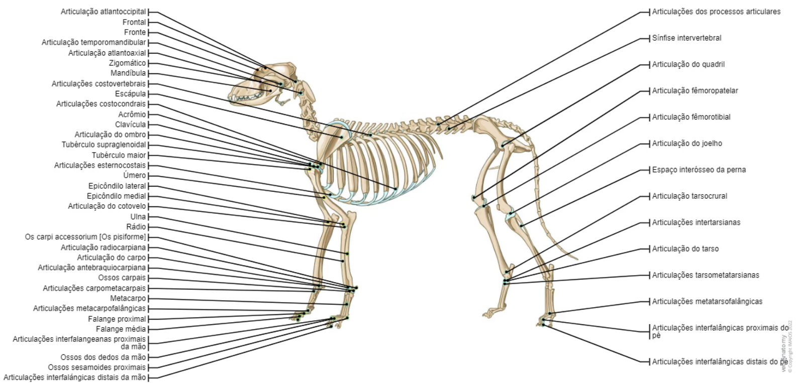

<h3 style="text-align:center">Etapas de Desenvolvimento</h3>

A **Etapa Pré-natal**, refere-se ao periodo antes do nascimento, a neonatal aos <ins>primeiros 14 dias</ins>, nos quais o cão ainda não é capaz de ver o mundo à sua volta, a **Etapa de Transição** que acontece <ins>entre os primeiros 13 a 21 dias</ins>, sendo que já são capazes de ver o mundo à sua volta e surgem os primeiros dentes de leite e a capacidade de distinguir diferentes sons, em seguida a **Etapa de Socialização**, sendo que é vital que haja a socialização com outros cães, e com pessoas em diferentes ambientes. A **Etapa Juvenil** acontece <ins>entre as 12 semanas e os 6 meses ou mais</ins>, tornando-se mais independente e tal como todos os adolescentes humanos, podem apresentar-se com demonstrações de falta de obediência, mais dispersão de atenção, maior distanciamento como também poderá demonstrar-se com falta de atenção. Finalmente inicia-se a **Etapa Adulta**, <ins>entre os primeiros 7 anos</ins> e em seguida a **Etapa Sénior** a partir dos 7 anos de vida, periodo este que tal como nas pessoas, aparecem as dificuldades motoras e irregularidades de saúde física e mental. 

| Esqueleto do Cão | 
| --- | 
|  | 

| Sistema Muscular do Cão | 
| --- | 
|  | 

| Sistema Circulatório do Cão | 
| --- | 
|  | 

| Anatomia do Ouvido do Cão | 
| --- | 
|  | 

| Anatomia da Boca do Cão | 
| --- | 
|  | 

Clicar [aqui](../README.md) para voltar para a página principal