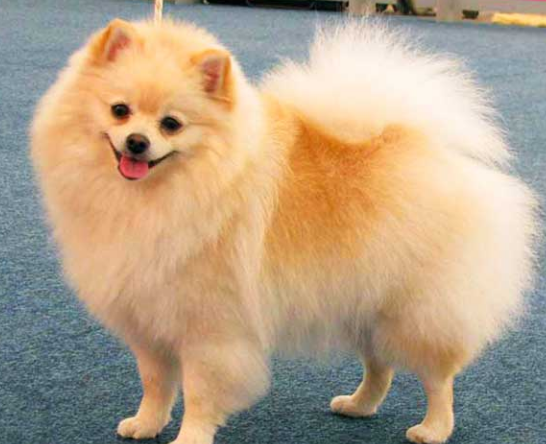

<h3 style="text-align:center"> Classificação </h3>

Existe [344](https://en.wikipedia.org/wiki/List_of_dog_breeds) raças caninas. A [FCI](https://fci.be/en) subdivide as várias raças reconhecidas, em 10 grupos. Estes são: 

### Primeiro Grupo

- Cães de Pasto e Boeiros

Todas as raças deste grupo têm como característica a enorme vontade de trabalharem em conjunto. São ótimas companhias para crianças, além de atentos, e, ainda que nada agressivos, são excelentes cães de guarda.

| País de Origem | Nomenclatura Oficial | Temperamento | Imagem | 
| --- | --- | --- | --- |  
| Australia | [Kelpie Australiano](https://www.fci.be/Nomenclature/Standards/293g01-en.pdf) | Pacífico, Energético, Guarda | | 
| Bélgica | [Cães Belga](https://www.fci.be/Nomenclature/Standards/015g01-en.pdf) | Pacífico, Energético, Guarda | | 
| Bélgica | Groenendael | Pacífico, Energético, Guarda |   | 
| Bélgica| Laekenois | Pacífico, Energético, Guarda |   | 
|Bélgica | Malinois | Pacífico, Energético, Guarda |   | 
| Bélgica| Tervueren | Pacífico, Energético, Guarda |   | 
| Bégica | [Schipperke](https://www.fci.be/Nomenclature/Standards/083g01-en.pdf) | Pacifico, Emergético |   | 
| Croácia | [Cão de Pasto Croáta](https://www.fci.be/Nomenclature/Standards/277g01-en.pdf) | Pacífico, Energético, Guarda |   | 
| Checoslováquia | [Cão Lobo Checo](https://www.fci.be/Nomenclature/Standards/332g01-en.pdf) | Pacífico, Energético, Guarda |   | 
| França | [Berger](https://www.fci.be/Nomenclature/Standards/044g01-en.pdf) | Pacífico, Energético, Guarda |   | 
| França | [Briard](https://www.fci.be/Nomenclature/Standards/113g01-en.pdf) | Pacífico, Energético, Guarda |   | 
| França | [Pyrenean](https://www.fci.be/Nomenclature/Standards/141g01-en.pdf) | Pacífico, Energético, Guarda |   | 
| França | [Picard](https://www.fci.be/Nomenclature/Standards/176g01-en.pdf) | Pacífico, Energético, Guarda |   | 
| França | [Pyrenean 2](https://www.fci.be/Nomenclature/Standards/138g01-en.pdf) | Pacífico, Energético, Guarda |   | 
| Alemanha | [Pastor Alemão](https://www.fci.be/Nomenclature/Standards/166g01-en.pdf) | Pacífico, Energético, Guarda |   | 
| Inglaterra | [Bearded Collie](https://www.fci.be/Nomenclature/Standards/271g01-en.pdf) | Pacífico, Energético, Guarda |   | 
| Inglaterra | [Border Collie](https://www.fci.be/Nomenclature/Standards/297g01-en.pdf) | Pacífico, Energético, Guarda |   | 
| Inglaterra | [Collie Rough](https://www.fci.be/Nomenclature/Standards/156g01-en.pdf) | Pacífico, Energético, Guarda |   | 
| Inglaterra | [Collie Smooth](https://www.fci.be/Nomenclature/Standards/296g01-en.pdf) | Pacífico, Energético, Guarda |   | 
| Inglaterra | [Antigo Cão de Pasto Inglês](https://www.fci.be/Nomenclature/Standards/016g01-en.pdf) | Pacífico, Energético, Guarda |   | 
| Inglaterra | [Cão de Pasto de Shetland](https://www.fci.be/Nomenclature/Standards/088g01-en.pdf) | Pacífico, Energético, Guarda |   | 
| Hungria | [Komondor](https://www.fci.be/Nomenclature/Standards/053g01-en.pdf) | Pacífico, Energético, Guarda |   | 
| Hungria | [Kuvasz](https://www.fci.be/Nomenclature/Standards/054g01-en.pdf) | Pacífico, Energético, Guarda |   | 
| Hungria | [Mudi](https://www.fci.be/Nomenclature/Standards/238g01-en.pdf) | Pacífico, Energético, Guarda |   | 
| Hungria | [Puli](https://www.fci.be/Nomenclature/Standards/055g01-en.pdf) | Pacífico, Energético, Guarda |   | 
| Hungria | [Pumi](https://www.fci.be/Nomenclature/Standards/056g01-en.pdf) | Pacífico, Energético, Guarda |   | 
| Italia | [Bergamasco](https://www.fci.be/Nomenclature/Standards/194g01-en.pdf) | Pacífico, Energético, Guarda |   | 
| Italia | [Maremma](https://www.fci.be/Nomenclature/Standards/201g01-en.pdf) | Pacífico, Energético, Guarda |   | 
| Polónia |  | Pacífico, Energético, Guarda |   | 
| Polónia |  | Pacífico, Energético, Guarda |   | 
| Portugal |  | Pacífico, Energético, Guarda |   | 
| Roménia |  | Pacífico, Energético, Guarda |   | 
| Roménia |  | Pacífico, Energético, Guarda |   | 
| Rússia |  | Pacífico, Energético, Guarda |   | 
| Islováquia |  | Pacífico, Energético, Guarda |   | 
| Espanha |  | Pacífico, Energético, Guarda |   | 
| Espanha |  | Pacífico, Energético, Guarda |   | 
| Suiça |  | Pacífico, Energético, Guarda |   | 
| Holanda |  | Pacífico, Energético, Guarda |   | 
| Holanda |  | Pacífico, Energético, Guarda |   | 
| Holanda |  | Pacífico, Energético, Guarda |   | 
| USA |  | Pacífico, Energético, Guarda |   | 

#### Segundo Grupo

[Cães de tipo Pinscher e Schnauzer, Molossóides e Cães de Montanha, e Boieiros Suiços](https://www.fci.be/en/nomenclature/2-Pinscher-and-Schnauzer-Molossoid-and-Swiss-Mountain-and-Cattledogs.html)
Neste grupo incluem-se, além do Pinscher e do Schnauzer, o Smoushond, o Terrier Preto Russo, as raças tipo Dogue, tipo Montanha e ainda os Boieiros Suiços. Na secção dos Pinscher estão contempladas as raças  Dobermann e o Pinscher Miniatura. Estes animais terão sido introduzidos, no início do século XIX, a partir de Inglaterra para a terra firme do continente europeu. A Affenpinscher é uma das mais antigas raças alemãs e as suas características têm permanecido praticamente inalteradas. Os exemplares desta raça podem viver até aos 15 anos e adoram pessoas. Além disso, derretem-se com mimos, são bons cães de guarda e não têm necessidade de grande atividade física.

| Pinscher | Schnauzer | Boeiro Suíço | 
| --- | --- | --- | 
|  |  |  | 

- **Terceiro Grupo**: [Terriers](https://www.fci.be/en/nomenclature/3-Terriers.html)
Neste grande grupo encontramos Terriers de tamanho grande e médio, Terriers de tamanho pequeno, Terriers de tipo Bull e Terriers de Companhia. Devido à sua aparência considerável, o Airedale Terrier é considerado o rei dos Terriers e é oriundo do condado de Yorkshire. Nesta zona, trabalhadores como mineiros ou agricultores precisavam de manter perto de si cães robustos para a caça e para conduzirem o gado, sendo os Airedale Terriers os animais indicados e que rapidamente encontraram muitos adeptos, em grande parte devido à sua fiabilidade e versatilidade. O Australian Terrier é uma raça que se adapta ao tamanho do apartamento citadino comum, desde que lhe sejam dadas oportunidades de fazer exercício suficiente. Originalmente esta era uma raça dedicada à guarda, pois os animais são robustos e fortes. O Fox Terrier de pelo cerdoso é também bastante comum na Europa, tendo sido bastante usado na caça da raposa e podendo ser visto em numerosos retratos históricos britânicos.

| Airdale Terrier | Australian Terrier | Toy Fox Terrier | 
| --- | --- | --- | 
|  |  | 

- **Quarto Grupo**: [Dachshund](https://www.fci.be/en/nomenclature/4-Dachshunds.html)
A raça Dachshund, também designada por Teckel ou 'salsicha', é conhecida desde a Idade Média. A partir da raça Bracken foram continuamente criados cães de pequena estatura, indicados para caçar ao nível do solo ou abaixo deste. Em resumo, assim se explicam as origens desta raça. Esta apresenta uma pelagem curta, densa e junto ao corpo com inúmeras gradações de cor entre o preto e o castanho-avermelhado. Os Dachshund são animais equilibrados, persistentes, com um faro delicado e bastante ágeis. Trata-se de uma raça criada em três tamanhos distintos – Standard, Miniatura e Kaninchen – e apresentam três comprimentos de pelo diferentes – cerdoso, comprido e raso. Os musculados Dachshund de pelo cerdoso não apresentam grande necessidade de movimento, podem chegar aos 17 anos e constituem excelentes cães de guarda.

| Dachschund | Dachschund | 
| ---  | --- |
|  |  | 

- **Quinto Grupo**: [Cães de tipo Spitz e de tipo Primitivo](https://www.fci.be/en/nomenclature/5-Spitz-and-primitive-types.html)
Neste grupo incluem-se os cães nórdicos de trenó, os cães nórdicos de caça, os cães nórdicos de guarda e pastoreio, e os Spitz europeus e asiáticos. O Spitz alemão é descendente do cão doméstico pré-histórico e, portanto, constitui a mais antiga raça da Europa Central. Os Spitz fazem-se notar pelo seu bonito pelo que sobressai bastante pela camada inferior. Os olhos vivaços e as orelhas pontiagudas conferem-lhe a aparência atrevida e animada que o caracteriza. O Spitz alemão é vivaz mas muito carinhoso e dócil e fácil de educar. Tratando-se de uma raça cautelosa no que diz respeito a desconhecidos é ideal como cão de guarda. As raças nórdicas são populares cães de pastoreio com pelo quentinho.

| Spitz Alemão | Spitz Japonês | 
| --- | --- |
|  |  | 

- **Sexto Grupo**: [Cães de Levante e Corso e raças semelhantes](https://www.fci.be/en/nomenclature/6-Scent-hounds-and-related-breeds.html)
Os cães de levante têm um faro bastante apurado e desde há muito que têm vindo a ajudar os humanos a caçar. Estes aceitam de bom grado as condições meteorológicas e seguem os rastos enuquanto ladram. Representantes deste grupo são, por exemplo, os Foxhound, os Laufhund, os Otterhund, os Français Tricolore e os Beagle. Os cães de corso são cães de caça especializados em encontrar presas feridas e, tal como os cães de levante, o seu olfato é apurado e segue explicitamente o rasto de animais selvagens feridos. Representantes deste tipo são o Sabujo montanhês da Baviera e o Basset alpino. Os cães de levante são treinados para caçar em matilha, ao passo que os cães de corso realizam as tarefas sozinhos.

| Foxhound | Laufhund | Beagle | 
| --- | --- | --- | 
|  |  |  | 

- **Sétimo Grupo**: [Cães de parar](https://www.fci.be/en/nomenclature/7-Pointing-Dogs.html)
Identificamos neste grupo cães de parar continentais como o Braco, o Spaniel e o Griffon, e ainda cães de parar britânicos e irlandeses, como os Pointer e os Setter. Os cães de parar devolvem prontamente peças de caça selvagem. São animais muito versáteis e a sua criação tem vindo a aumentar desde que as armas de fogo se tornaram populares. Não matam a presa, ao invés, apontam calmamente a sua posição. No que se refere a esta tarefa, a sua popularidade já viu melhores dias, mas pelo facto de combinarem características de diversas raças de caça são bastante requisitados como fiéis companheiros. No entanto, não devem ser mantidos como animais de estimação por leigos – o seu lugar é nas mãos dos caçadores.

| Braco | Spaniel | Griffon | 
| --- | --- | --- | 
|  |  |  | 

- **Oitavo Grupo**: [Cães Levantadores e Cobradores de Caça e Cães de Água](https://www.fci.be/en/nomenclature/8-Retrievers-Flushing-Dogs-Water-Dogs.html)
Os levantadores são cães de caça dedicados a encontrar animais selvagens voadores e a devolvê-los aos caçadores. Os cobradores são cães que procuram no mato, e de forma independente, por pequenos animais selvagens. Nesta categoria incluem-se as raças Cocker Spaniel inglês, Cocker Spaniel americano, Springer Spaniel inglês, Field Spaniel, pequeno cão holandês (ou  Kooikerhondje) ou o Springer Spaniel de Gales. Os cães de água contribuem com a sua ajuda em momentos de pesca. O American Spaniel descende do Springer Spaniel inglês e é a raça Spaniel de menores dimensões. O Chesapeake Bay Retriever foi criado especificamente para caçar na água e, além de cobrador, conseguir partir gelo e suportar águas geladas.

| Chesapeake Bay | Kooikerhondje | Cocker Spaniel | 
| --- | --- | --- |
|  |  |  | 

- **Nono Grupo**: [Cães de Companhia e de Assistência](https://www.fci.be/en/nomenclature/9-Companion-and-Toy-Dogs.html)
Falamos agora de cães que são usados pelos donos como animais de companhia e parceiros sociais. Neste grande grupo encontramos os Bichons, os Caniche, os cães belgas de tamanho pequeno, os cães nus, os cães do Tibete, os Pequinês e os Chihuahua.  O Bichon Frisé, por exemplo, é divertido, independente e bem-humorado, além de aprender rapidamente e ser fácil de educar. O Bichon Bolonhês, por seu lado, apresenta uma estatura física delicada, é sociável e adequado para famílias. O Bolonka é um verdadeiro cão de colo – os exemplares desta raça são amigáveis e vivaços e, portanto, fantásticos companheiros de brincadeiras. O Boston Terrier, raça criada em Boston na década de 70 do século XX, apresenta um temperamento bastante equilibrado – são animais espertos, ativos, determinados e dóceis. Desde a sua descoberta em 1850 que o Chihuahua é considerada a raça de cães mais pequena do mundo; acredita-se que descendem dos cães sacrificados em rituais há milhares de anos no antigo México. Desde o século XIX que os fazendeiros na província de Chihuahua vendem estes animais aos turistas, contribuindo assim para a raça se disseminasse na Europa. Os Chihuahuas podem apresentar traços de personalidade a oscilar entre o vigilante e o brincalhão.

| Bichon Frise | Chihuahua | Caniche | 
| --- | --- | --- | 
|  |  |  | 

- **Décimo Grupo**: [Galgos](https://www.fci.be/en/nomenclature/10-Sighthounds.html)
Sejam galgos de pelo comprido e franjeado, de pelo cerdoso ou de pelo curto, estes cães elegantes e de longas pernas são dos animais terrestres mais rápidos do mundo, lado a lado com as chitas. Foram criados para o desempenho de tarefas concretas, como a caça de longa distância. De acordo com a origem de cada qual é possível diferenciar entre os galgos ocidentais e orientais – características destes últimos são as orelhas caídas e a independência de carácter, enquanto os galgos ocidentais são excelentes velocistas e têm orelhas cor-de-rosa.

| Galgo | Galgo | Galgo | 
| --- | --- | --- | 
|  |  |   | 

<h3 style="text-align:center">As Características Inatas</h3>

Como se poderá ler nos diferentes grupos de cães que foram esquematizados, cada grupo apresenta diferentes características inatas que estão mais desenvolvidas do que outros grupos. Considera-se que as diferentes raças caninas desenvolveram qualidades especificas, umas que são mais predatórias e outras mais dóceis e sociais. Mesmo que todos os cães tenham características fisiológicas semelhantes ou até iguais, ao nível comportamental e temperamental, as qualidades emocionais de cada cão, permitem que cada grupo de cães, possa ter diferentes funções com base nas suas características físicas e temperamentais, sabendo que, são as experiências de cada animal, que potenciam ou diminuem as irregularidades comportamentais. As técnicas educativas é que serão as responsáveis pelo comportamento futuro dos animais em questão. 

Clicar [aqui](../README.md) para voltar para a página principal